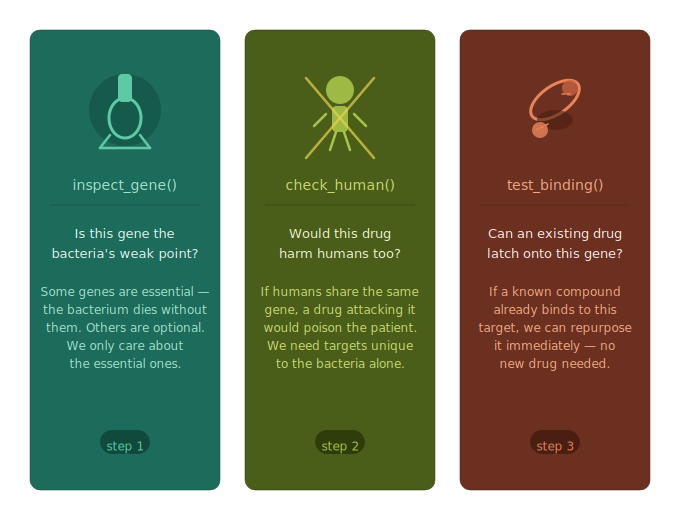

# GeneSieve Environment

A reinforcement learning environment for training agents to identify optimal gene targets in bacterial pathogens.

---

## Background

Disease-causing organisms collectively called **Pathogens** (including bacteria, viruses, fungi, and parasites) are treated using drugs that disrupt the essential processes they need to survive and reproduce. These drugs typically work by binding to a specific protein or interfering with a critical biological pathway inside the pathogen, effectively shutting it down.

---

## Problem and Shift

Historically, drug discovery often relied on testing random substances (such as mold, chemicals, or plant extracts) to see if they could kill pathogens. While this led to important breakthroughs, this approach has clear limitations:

- Not precise  
- Can harm human cells  
- Pathogens can evolve resistance  
- Often unclear *why* a treatment works  

Modern drug discovery uses a more focused strategy called **Target Identification**.

Instead of broadly attacking a pathogen, we ask:

> **What is the one critical component this organism needs to survive?**

This component is usually a **gene** or the **protein** it produces.

Scientists identify targets that:
- Are essential for the pathogen’s survival  
- Are sufficiently different from human cells  

Once identified, drugs can be designed to specifically block these targets—often described as a *lock-and-key* mechanism—stopping the pathogen while minimizing harm to the patient.



---

## Environment

This is where **OpenEnv** comes into play.

In a typical scenario, a pathogen may have hundreds of genes (e.g., ~300+ candidates). Each gene needs to be evaluated across multiple criteria before it can be considered a viable drug target. This is not a single-step problem—it’s a **multi-step decision process** involving exploration, validation, and trade-offs.

For each gene, we need to answer questions like:
- Is the gene essential for the pathogen’s survival?  
- Does it have similarity to human genes (risk of side effects)?  
- Can a drug realistically bind to the protein it produces?  

To model this, GeneSieve provides a simple **tool-based environment** that the agent can interact with:

- `inspect_gene()` → get detailed information about a gene  
- `check_human_match()` → check similarity with human biology  
- `test_binding()` → estimate if a drug can bind effectively  

The agent doesn’t get all answers upfront. Instead, it has to **explore step-by-step**:

1. Pick a gene  
2. Use tools to gather evidence  
3. Build understanding  
4. Decide whether to keep or discard the gene  



### reward system
```
+0.5  → correct `inspect_gene` (essential)  
-0.2  → non-essential gene  

+0.3  → safe (no human homolog)  
-0.1  → unsafe  

+0.35 → binding exists  
-0.1  → no binding  

-0.15 → repeated action  
-0.3  → invalid tool/gene  
-0.4  → both invalid  

+0.4 to +3.0 → correct target (more reward with more evidence & efficiency)  
-1.0 to -1.8 → wrong target (higher penalty with more tests)  
-0.5 → blind guess / no tests  
-0.5 → ignored negative evidence  
-0.5 → ran out of budget without submitting  
```

---

## Links
mini blog link - 
Colab Notebook link -
Code repository link -
Hugging Face Space URL -

## Quick Start

The simplest way to use the Genesieve environment is through the `GenesieveEnv` class:

```python
from GeneSieve import GenesieveAction, GenesieveEnv

try:
    # Create environment from Docker image
    GeneSieveenv = GenesieveEnv.from_docker_image("GeneSieve-env:latest")

    # Reset
    result = GeneSieveenv.reset()
    print(f"Reset: {result.observation.echoed_message}")

    # Send multiple messages
    messages = ["Hello, World!", "Testing echo", "Final message"]

    for msg in messages:
        result = GeneSieveenv.step(GenesieveAction(message=msg))
        print(f"Sent: '{msg}'")
        print(f"  → Echoed: '{result.observation.echoed_message}'")
        print(f"  → Length: {result.observation.message_length}")
        print(f"  → Reward: {result.reward}")

finally:
    # Always clean up
    GeneSieveenv.close()
```

That's it! The `GenesieveEnv.from_docker_image()` method handles:
- Starting the Docker container
- Waiting for the server to be ready
- Connecting to the environment
- Container cleanup when you call `close()`

## Building the Docker Image

Before using the environment, you need to build the Docker image:

```bash
# From project root
docker build -t GeneSieve-env:latest -f server/Dockerfile .
```

## Deploying to Hugging Face Spaces

You can easily deploy your OpenEnv environment to Hugging Face Spaces using the `openenv push` command:

```bash
# From the environment directory (where openenv.yaml is located)
openenv push

# Or specify options
openenv push --namespace my-org --private
```

The `openenv push` command will:
1. Validate that the directory is an OpenEnv environment (checks for `openenv.yaml`)
2. Prepare a custom build for Hugging Face Docker space (enables web interface)
3. Upload to Hugging Face (ensuring you're logged in)

### Prerequisites

- Authenticate with Hugging Face: The command will prompt for login if not already authenticated

### Options

- `--directory`, `-d`: Directory containing the OpenEnv environment (defaults to current directory)
- `--repo-id`, `-r`: Repository ID in format 'username/repo-name' (defaults to 'username/env-name' from openenv.yaml)
- `--base-image`, `-b`: Base Docker image to use (overrides Dockerfile FROM)
- `--private`: Deploy the space as private (default: public)

### Examples

```bash
# Push to your personal namespace (defaults to username/env-name from openenv.yaml)
openenv push

# Push to a specific repository
openenv push --repo-id my-org/my-env

# Push with a custom base image
openenv push --base-image ghcr.io/meta-pytorch/openenv-base:latest

# Push as a private space
openenv push --private

# Combine options
openenv push --repo-id my-org/my-env --base-image custom-base:latest --private
```

After deployment, your space will be available at:
`https://huggingface.co/spaces/<repo-id>`

The deployed space includes:
- **Web Interface** at `/web` - Interactive UI for exploring the environment
- **API Documentation** at `/docs` - Full OpenAPI/Swagger interface
- **Health Check** at `/health` - Container health monitoring
- **WebSocket** at `/ws` - Persistent session endpoint for low-latency interactions

## Environment Details

### Action
**GenesieveAction**: Contains a single field
- `message` (str) - The message to echo back

### Observation
**GenesieveObservation**: Contains the echo response and metadata
- `echoed_message` (str) - The message echoed back
- `message_length` (int) - Length of the message
- `reward` (float) - Reward based on message length (length × 0.1)
- `done` (bool) - Always False for echo environment
- `metadata` (dict) - Additional info like step count

### Reward
The reward is calculated as: `message_length × 0.1`
- "Hi" → reward: 0.2
- "Hello, World!" → reward: 1.3
- Empty message → reward: 0.0

## Advanced Usage

### Connecting to an Existing Server

If you already have a Genesieve environment server running, you can connect directly:

```python
from GeneSieve import GenesieveEnv

# Connect to existing server
GeneSieveenv = GenesieveEnv(base_url="<ENV_HTTP_URL_HERE>")

# Use as normal
result = GeneSieveenv.reset()
result = GeneSieveenv.step(GenesieveAction(message="Hello!"))
```

Note: When connecting to an existing server, `GeneSieveenv.close()` will NOT stop the server.

### Using the Context Manager

The client supports context manager usage for automatic connection management:

```python
from GeneSieve import GenesieveAction, GenesieveEnv

# Connect with context manager (auto-connects and closes)
with GenesieveEnv(base_url="http://localhost:8000") as env:
    result = env.reset()
    print(f"Reset: {result.observation.echoed_message}")
    # Multiple steps with low latency
    for msg in ["Hello", "World", "!"]:
        result = env.step(GenesieveAction(message=msg))
        print(f"Echoed: {result.observation.echoed_message}")
```

The client uses WebSocket connections for:
- **Lower latency**: No HTTP connection overhead per request
- **Persistent session**: Server maintains your environment state
- **Efficient for episodes**: Better for many sequential steps

### Concurrent WebSocket Sessions

The server supports multiple concurrent WebSocket connections. To enable this,
modify `server/app.py` to use factory mode:

```python
# In server/app.py - use factory mode for concurrent sessions
app = create_app(
    GenesieveEnvironment,  # Pass class, not instance
    GenesieveAction,
    GenesieveObservation,
    max_concurrent_envs=4,  # Allow 4 concurrent sessions
)
```

Then multiple clients can connect simultaneously:

```python
from GeneSieve import GenesieveAction, GenesieveEnv
from concurrent.futures import ThreadPoolExecutor

def run_episode(client_id: int):
    with GenesieveEnv(base_url="http://localhost:8000") as env:
        result = env.reset()
        for i in range(10):
            result = env.step(GenesieveAction(message=f"Client {client_id}, step {i}"))
        return client_id, result.observation.message_length

# Run 4 episodes concurrently
with ThreadPoolExecutor(max_workers=4) as executor:
    results = list(executor.map(run_episode, range(4)))
```

## Development & Testing

### Direct Environment Testing

Test the environment logic directly without starting the HTTP server:

```bash
# From the server directory
python3 server/GeneSieve_environment.py
```

This verifies that:
- Environment resets correctly
- Step executes actions properly
- State tracking works
- Rewards are calculated correctly

### Running Locally

Run the server locally for development:

```bash
uvicorn server.app:app --reload
```

## Project Structure

```
GeneSieve/
├── .dockerignore         # Docker build exclusions
├── __init__.py            # Module exports
├── README.md              # This file
├── openenv.yaml           # OpenEnv manifest
├── pyproject.toml         # Project metadata and dependencies
├── uv.lock                # Locked dependencies (generated)
├── client.py              # GenesieveEnv client
├── models.py              # Action and Observation models
└── server/
    ├── __init__.py        # Server module exports
    ├── GeneSieve_environment.py  # Core environment logic
    ├── app.py             # FastAPI application (HTTP + WebSocket endpoints)
    └── Dockerfile         # Container image definition
```
