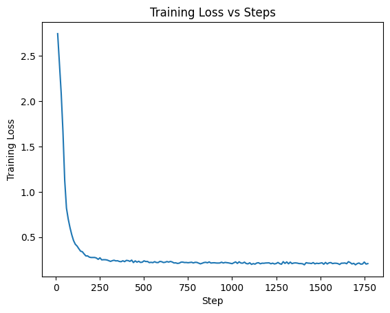

# GeneSieve Environment

A reinforcement learning environment for training agents to identify optimal gene targets in bacterial pathogens.

---

## Background

Disease-causing organisms collectively called **Pathogens** (including bacteria, viruses, fungi, and parasites) are treated using drugs that disrupt the essential processes they need to survive and reproduce. These drugs typically work by binding to a specific protein or interfering with a critical biological pathway inside the pathogen, effectively shutting it down.

---

## Problem and Shift

Historically, drug discovery often relied on testing random substances (such as mold, chemicals, or plant extracts) to see if they could kill pathogens. While this led to important breakthroughs, this approach has clear limitations:

- Not precise  
- Can harm human cells  
- Pathogens can evolve resistance  
- Often unclear *why* a treatment works  

Modern drug discovery uses a more focused strategy called **Target Identification**.

Instead of broadly attacking a pathogen, we ask:

> **What is the one critical component this organism needs to survive?**

This component is usually a **gene** or the **protein** it produces.

Scientists identify targets that:
- Are essential for the pathogen’s survival  
- Are sufficiently different from human cells  

Once identified, drugs can be designed to specifically block these targets—often described as a *lock-and-key* mechanism—stopping the pathogen while minimizing harm to the patient.


---

## Environment

This is where **OpenEnv** comes into play.

In a typical scenario, a pathogen may have hundreds of genes (e.g., ~300+ candidates). Each gene needs to be evaluated across multiple criteria before it can be considered a viable drug target. This is not a single-step problem—it’s a **multi-step decision process** involving exploration, validation, and trade-offs.

For each gene, we need to answer questions like:
- Is the gene essential for the pathogen’s survival?  
- Does it have similarity to human genes (risk of side effects)?  
- Can a drug realistically bind to the protein it produces?  

To model this, GeneSieve provides a simple **tool-based environment** that the agent can interact with:

- `inspect_gene()` → get detailed information about a gene  
- `check_human_match()` → check similarity with human biology  
- `test_binding()` → estimate if a drug can bind effectively  

The agent doesn’t get all answers upfront. Instead, it has to **explore step-by-step**:

1. Pick a gene  
2. Use tools to gather evidence  
3. Build understanding  
4. Decide whether to keep or discard the gene  


### reward system
```
+0.5  → correct `inspect_gene` (essential)  
-0.2  → non-essential gene  

+0.3  → safe (no human homolog)  
-0.1  → unsafe  

+0.35 → binding exists  
-0.1  → no binding  

-0.15 → repeated action  
-0.3  → invalid tool/gene  
-0.4  → both invalid  

+0.4 to +3.0 → correct target (more reward with more evidence & efficiency)  
-1.0 to -1.8 → wrong target (higher penalty with more tests)  
-0.5 → blind guess / no tests  
-0.5 → ignored negative evidence  
-0.5 → ran out of budget without submitting  
```

---

## Links

- Mini blog: https://github.com/NihalNavath/GeneSieve/blob/main/README.md
- Colab notebook: https://colab.research.google.com/drive/1Y2MmZxCnw-i9w-59epO6QVdwMels7JpX?usp=sharing
- Code repository: https://github.com/NihalNavath/GeneSieve
- Hugging Face Space: https://huggingface.co/spaces/Nihal50/GeneSieve

## Training
1) SFT
## Training

### 1) SFT (Supervised Fine-Tuning)

SFT is the first stage where the agent learns basic behavior by imitating correct examples.

In our environment, the agent can use tools (as mentioned in this read me).

Instead of exploring on its own, the model is shown expert-like trajectories of how to solve the task including which tools to use, in what order, and when to submit a target.

A typical trajectory looks like:

```
Observation: Gene A  
Action: query_pathways(Gene A)  
Observation: involved in cell wall synthesis  
Action: query_essentiality(Gene A)  
Observation: essential  
Action: submit_target(Gene A)
```

The model is trained to predict the next action given the current state and history (standard next-token prediction).

#### Why this step matters
Without SFT, the agent behaves randomly and fails to use tools properly.  
SFT gives it:
- basic tool usage
- structured reasoning patterns
- a strong starting policy

#### Data source
Training data comes from:
- heuristic / rule-based agents (used as the “teacher”)
- scripted or manually written trajectories

#### Outcome
After SFT, the agent is no longer random — it can:
- use tools coherently
- follow reasonable decision paths
- produce valid (but not optimal) solutions

This sets the foundation for the next stage (RL), where the agent improves beyond these demonstrations.

# Diagrams
SFT training
